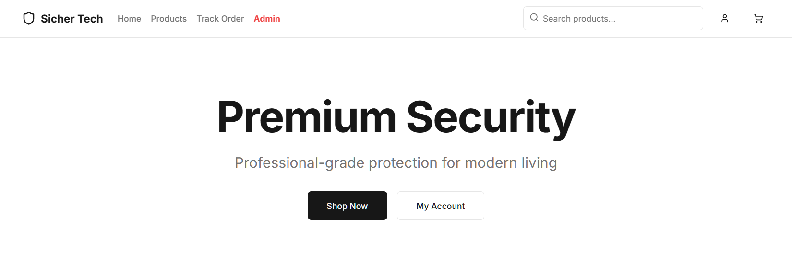
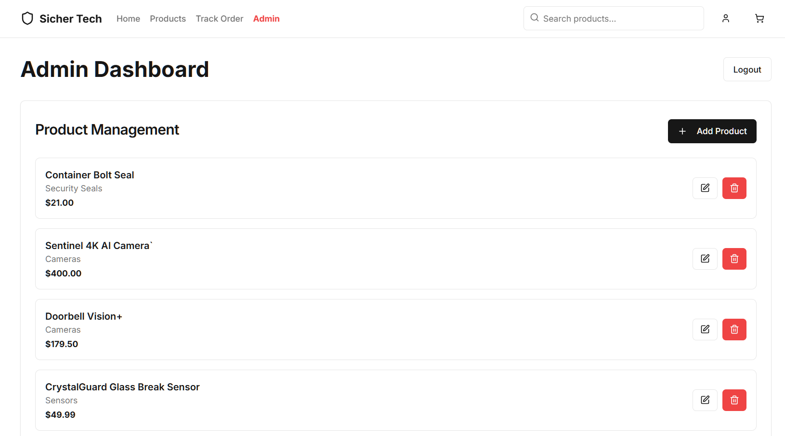
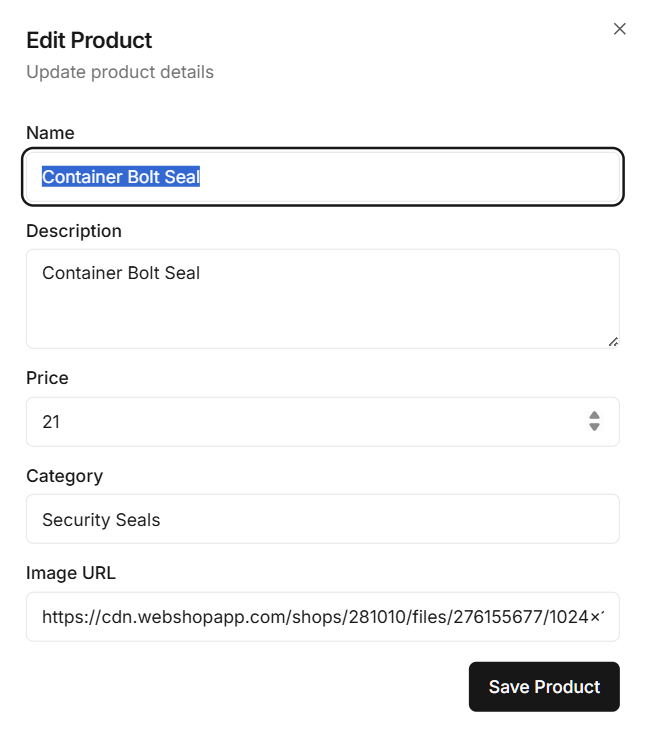
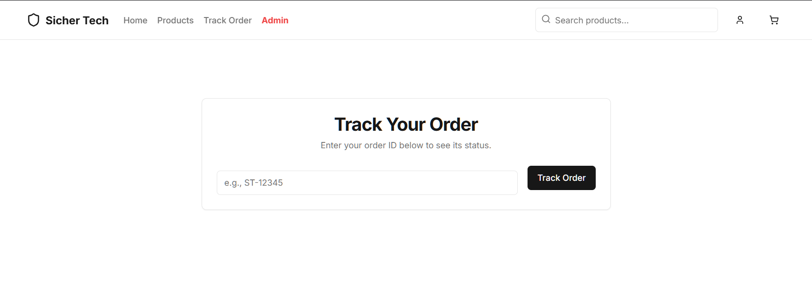

# Sicher Tech

A modern **AI-powered e-commerce platform for premium security
products**, built with **Next.js 15, Firebase, TailwindCSS, and Google
Genkit AI**.

------------------------------------------------------------------------

# Application Preview

## Homepage

The landing page introduces the platform with a clean hero section,
product browsing, and account access.

------------------------------------------------------------------------

## Admin Dashboard

Admins can manage the entire product catalog including adding, editing,
and deleting products.

------------------------------------------------------------------------

## Edit Product Modal

Admins can update product name, description, category, price, and image.

------------------------------------------------------------------------

## Order Tracking

Customers can track orders using an order ID and see the delivery
status.

------------------------------------------------------------------------

# Features

## E-commerce

-   Product catalog for security devices
-   Shopping cart with persistent state
-   Secure checkout
-   Order tracking system

## Authentication

-   Customer accounts
-   Admin dashboard
-   Role-based access control
-   Firebase Authentication

## AI Features

-   Product recommendations
-   AI product explanations
-   Powered by Google Genkit

------------------------------------------------------------------------

# Tech Stack

  Category    Technology
  ----------- --------------------
  Framework   Next.js 15
  Language    TypeScript
  Styling     TailwindCSS
  UI          Radix UI + shadcn
  Auth        Firebase Auth
  Database    Firebase Firestore
  AI          Google Genkit

------------------------------------------------------------------------

# Project Structure

    src/
    ├── ai/
    │   └── flows/
    │       ├── explain-product.ts
    │       └── product-recommendations.ts
    ├── app/
    │   ├── account/
    │   ├── admin/
    │   ├── cart/
    │   ├── checkout/
    │   ├── login/
    │   ├── signup/
    │   ├── products/
    │   └── track-order/
    ├── components/
    │   ├── ui/
    │   └── admin/
    ├── contexts/
    │   └── auth-context.tsx
    ├── hooks/
    └── lib/
        ├── auth.ts
        ├── firebase.ts
        └── products.ts

------------------------------------------------------------------------

# Getting Started

## Prerequisites

-   Node.js 18+
-   npm or yarn
-   Firebase project with Firestore enabled

------------------------------------------------------------------------

## Installation

### Clone Repository

    git clone https://github.com/Z1TH1Z/Sicher.git
    cd Sicher

### Install Dependencies

    npm install

### Environment Variables

Create `.env.local`

    NEXT_PUBLIC_FIREBASE_API_KEY=your_api_key
    NEXT_PUBLIC_FIREBASE_AUTH_DOMAIN=your_project.firebaseapp.com
    NEXT_PUBLIC_FIREBASE_PROJECT_ID=your_project_id
    NEXT_PUBLIC_FIREBASE_STORAGE_BUCKET=your_project.appspot.com
    NEXT_PUBLIC_FIREBASE_MESSAGING_SENDER_ID=your_sender_id
    NEXT_PUBLIC_FIREBASE_APP_ID=your_app_id

    GOOGLE_API_KEY=your_google_ai_api_key

------------------------------------------------------------------------

### Run Development Server

    npm run dev

Open:

    http://localhost:9002

------------------------------------------------------------------------

# Database Schema

## users

    {
      uid: string,
      email: string,
      role: "customer" | "admin",
      createdAt: timestamp
    }

## products

    {
      id: string,
      name: string,
      description: string,
      price: number,
      image: string,
      category: string,
      specs: Record<string,string>
    }

------------------------------------------------------------------------

# Deployment

## Deploy to Vercel

1.  Push repository to GitHub
2.  Import project into Vercel
3.  Add environment variables
4.  Deploy

------------------------------------------------------------------------

# Scripts

  Command                 Description
  ----------------------- --------------------------
  npm run dev             Start development server
  npm run build           Build project
  npm run start           Start production server
  npm run seed:products   Seed sample products
  npm run promote:admin   Promote admin user

------------------------------------------------------------------------

# Author

Built with ❤️ by **Z1TH1Z**
